# vaspvis
A highly flexible and customizable library for visualizing electronic structure data from VASP calculations.

# Installation

```bash
pip install vaspvis
```

# Loading Data


```python
from vaspvis import Band, Dos

# Non-HSE Calculation (plain band structure)
bs = Band(folder='path to vasp output folder')


# Non-HSE Calculation (projected band structure)
bs_projected = Band(folder='path to vasp output folder', projected=True)

# HSE Calculation (plain band structure)
bs_hse = Band(
    folder='path to vasp output folder',
    hse=True,
    kpath='GXWLGK', # Path used in calculation
    n=30, # Number of points between with high symmetry points
)

# HSE Calculation (projected band structure)
bs_hse = Band(
    folder='path to vasp output folder',
    projected=True,
    hse=True,
    kpath='GXWLGK', # Path used in calculation
    n=30, # Number of points between with high symmetry points
)

# Density of states (projected or non-projected)
dos = Dos(folder='path to vasp output folder')
```

**Important Note:** For spin projected orbitals you must load the spin up and spin down chanels separately using the `spin = 'up'` or `spin = 'down'` options with loading data. Default is `spin = 'up'`. An example of a spin projected band plot is coming soon.


# vaspvis.core.band

## `class Band()`

Method for constructing and plotting band structures from VASP calculations.

```python
plot_plain(ax, color='black', linewidth=1.25)
```
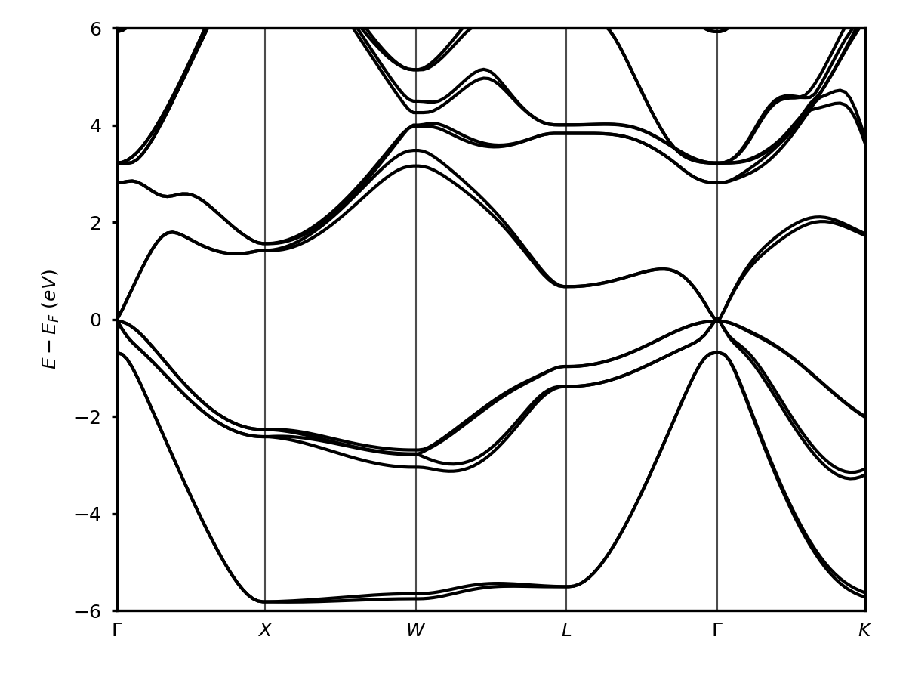


```python
plot_spd(self, ax, scale_factor=5, order=['s', 'p', 'd'], color_dict=None, legend=True, linewidth=0.75, band_color='black')
```
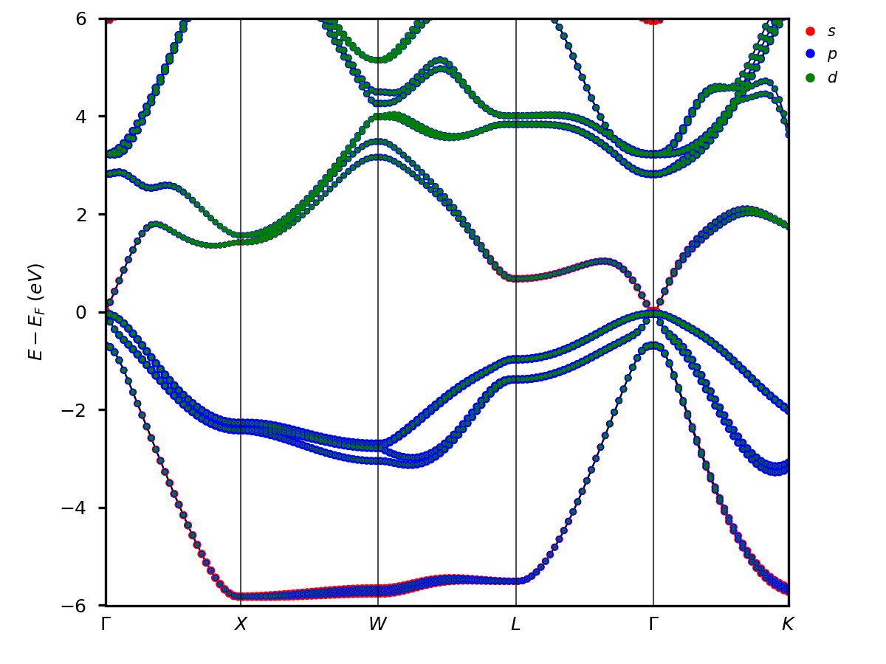

```python
plot_orbitals(self, orbitals, ax, scale_factor=5, color_dict=None, legend=True, linewidth=0.75, band_color='black')
```
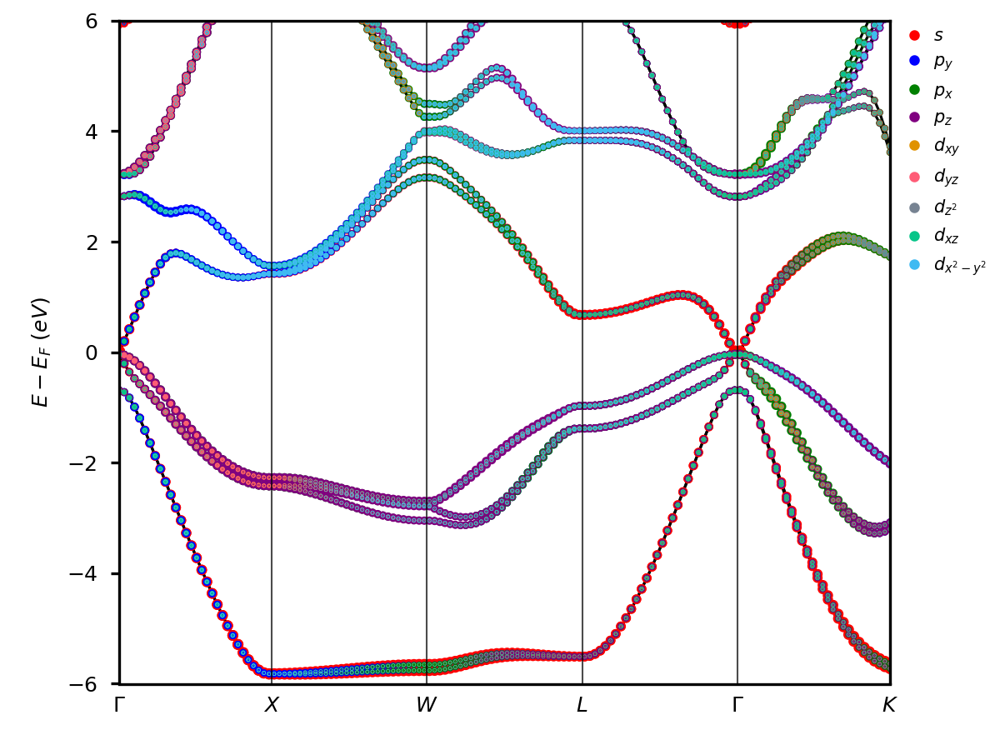

```python
plot_atom_orbitals(self, atom_orbital_pairs, ax, scale_factor=5, color_list=None, legend=True, linewidth=0.75, band_color='black')
```
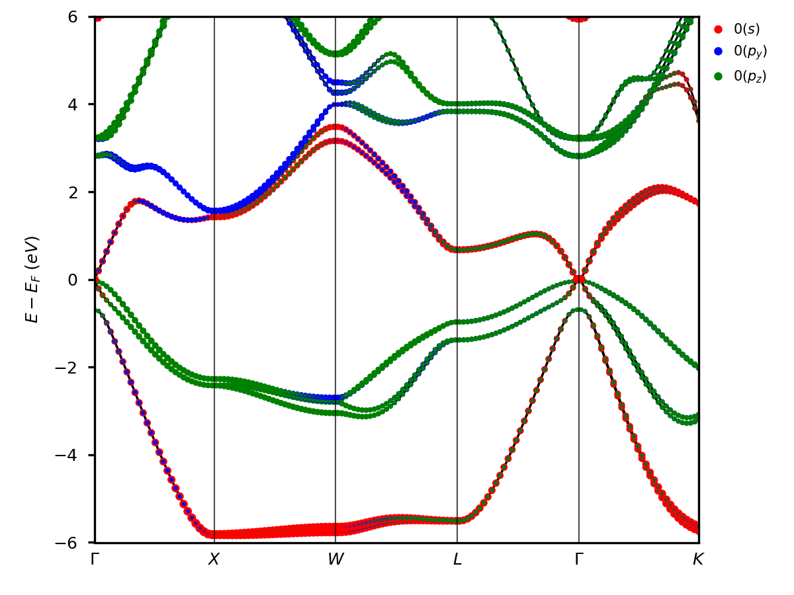

```python
plot_atoms(self, atoms, ax, scale_factor=5, color_list=None, legend=True, linewidth=0.75, band_color='black')
```
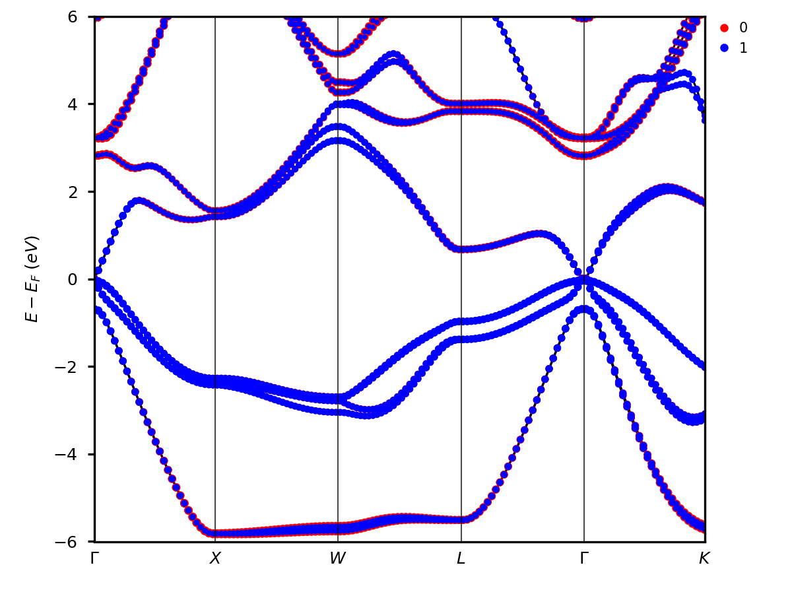

```python
plot_elements(self, elements, ax, scale_factor=5, color_list=None, legend=True, linewidth=0.75, band_color='black')
```
<!--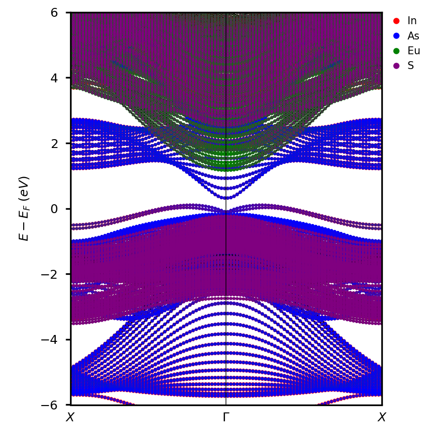-->

```python
plot_element_orbitals(self, element_orbital_pairs, ax, scale_factor=5, color_list=None, legend=True, linewidth=0.75, band_color='black')
```
<!--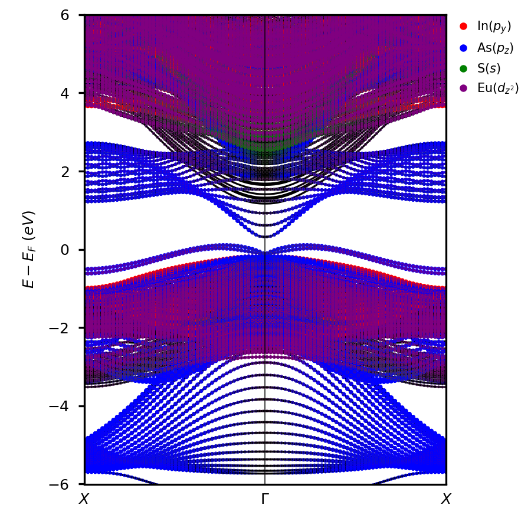-->

```python
plot_element_spd(self, elements, ax, order=['s', 'p', 'd'], scale_factor=5, color_dict=None, legend=True, linewidth=0.75, band_color='black')
```

# vaspvis.core.dos

## `class Dos()`

Method for constructing and plotting the density of states from VASP calculations.

```python
plot_plain(ax, linewidth=1.5, fill=True, alpha=0.3, sigma=0.05, energyaxis='y')
```


```python
plot_spd(ax, order=['s', 'p', 'd'], fill=True, alpha=0.3, linewidth=1.5, sigma=0.05, energyaxis='y', color_dict=None, legend=True, total=True)
```
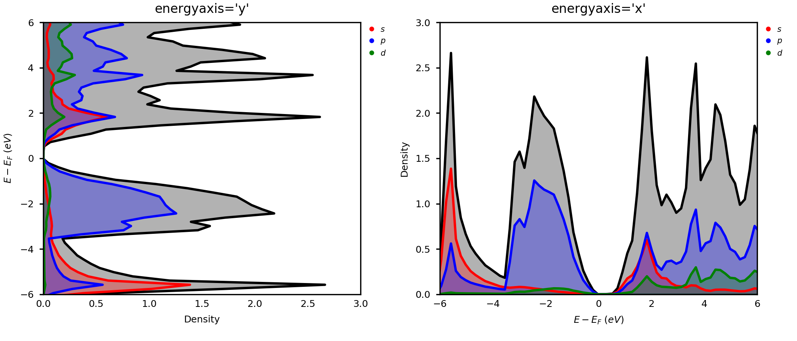

```python
plot_orbitals(ax, orbitals, fill=True, alpha=0.3, linewidth=1.5, sigma=0.05, energyaxis='y', color_dict=None, legend=True, total=True)
```
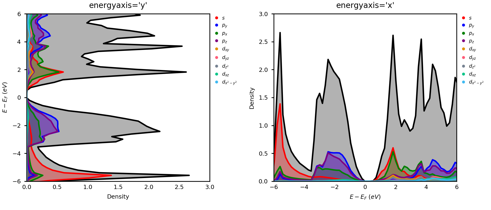

```python
plot_atom_orbitals(ax, atom_orbital_pairs, fill=True, alpha=0.3, linewidth=1.5, sigma=0.05, energyaxis='y', color_list=None, legend=True, total=True)
```
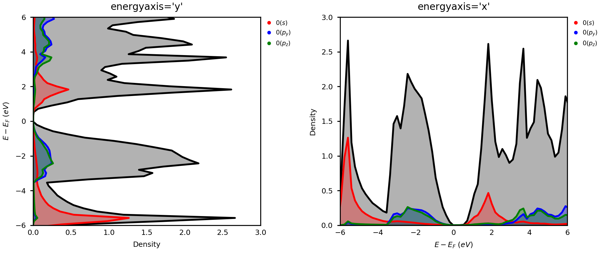

```python
plot_atoms(ax, atoms, fill=True, alpha=0.3, linewidth=1.5, sigma=0.05, energyaxis='y', color_list=None, legend=True, total=True)
```
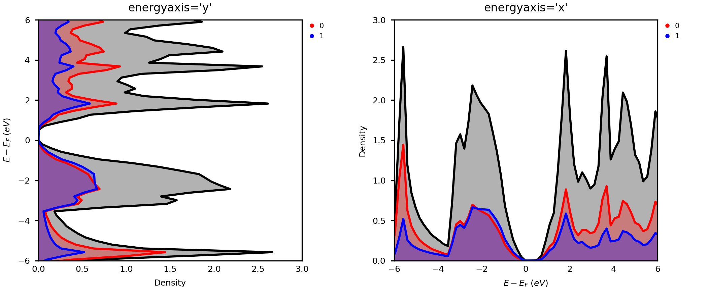

```python
plot_elements(ax, elements, fill=True, alpha=0.3, linewidth=1.5, sigma=0.05, energyaxis='y', color_list=None, legend=True, total=True)
```
<!--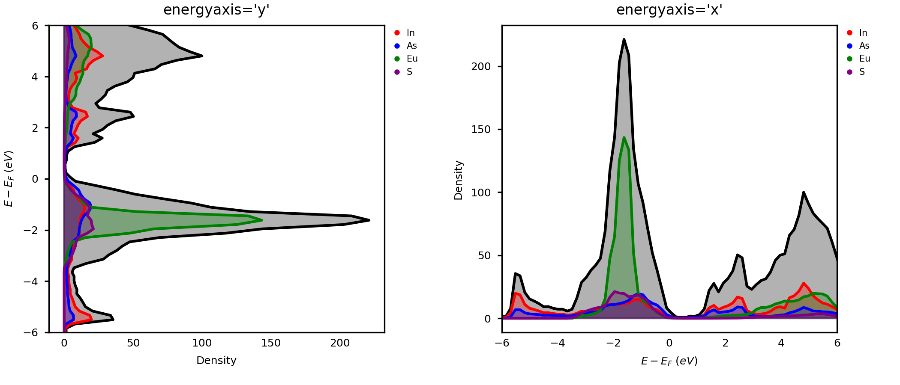-->

```python
plot_element_orbitals(ax, elements, orbitals, fill=True, alpha=0.3, linewidth=1.5, sigma=0.05, energyaxis='y', color_list=None, legend=True, total=True)
```
<!--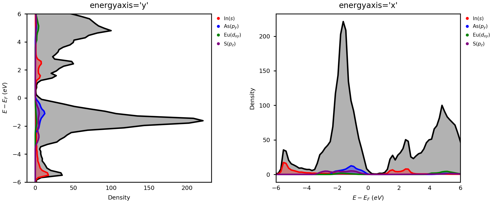-->

```python
plot_element_spd(ax, elements, order=['s', 'p', 'd'], fill=True, alpha=0.3, linewidth=1.5, sigma=0.05, energyaxis='y', color_dict=None, legend=True, total=True)
```
<!--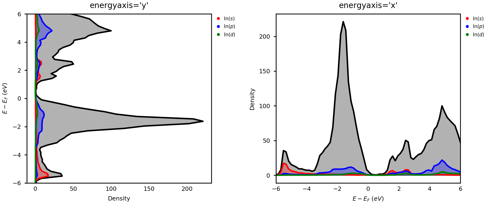-->

```python
plot_layers(ax, ylim=[-6, 6], cmap='magma', sigma=5)
```
<!--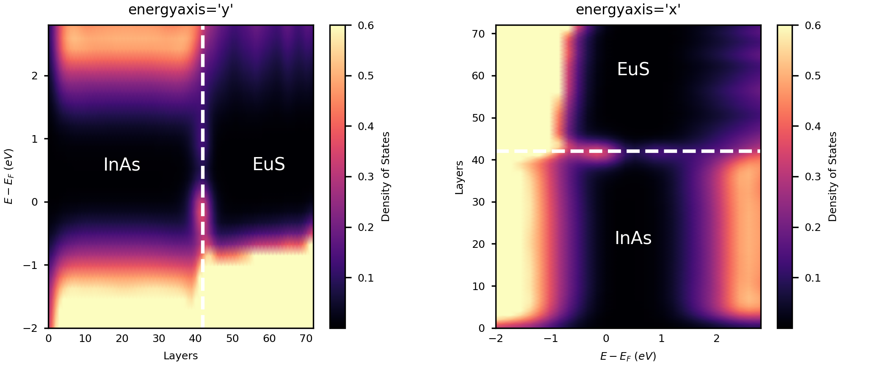-->


