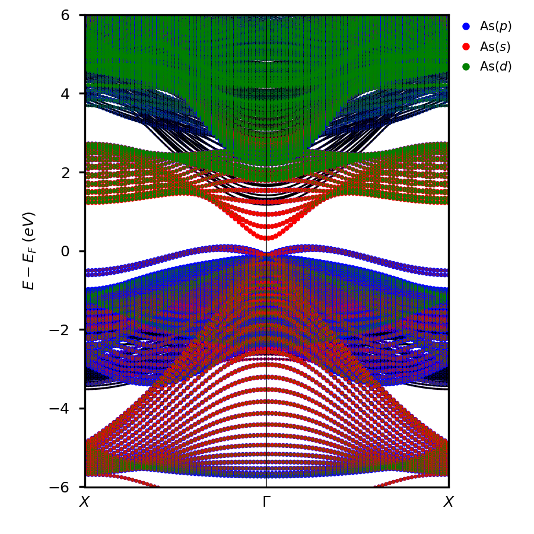

# vaspvis
A highly flexible and customizable library for visualizing electronic structure data from VASP calculations.

# vaspvis.core.band

## `class BandStructure()`

Method for constructing and plotting band structures from VASP calculations.

```python
plot_plain(ax, color='black', linewidth=1.5)
```


```python
plot_spd(ax, scale_factor=5, order=['s', 'p', 'd'], color_dict=None, legend=True)
```


```python
plot_orbitals(orbitals, ax, scale_factor=5, color_dict=None, legend=True)
```


```python
plot_atom_orbitals(atom_orbital_pairs, ax, scale_factor=5, color_dict=None, legend=True)
```


```python
plot_atoms(atoms, ax, scale_factor=5, color_dict=None, legend=True)
```


```python
plot_elements(elements, ax, scale_factor=5, color_dict=None, legend=True)
```


```python
plot_element_orbitals(elements, orbitals, ax, scale_factor=5, color_dict=None, legend=True)
```


```python
plot_element_spd(elements, ax, order=['s', 'p', 'd'], scale_factor=5, color_dict=None, legend=True)
```



# vaspvis.core.dos

## `class DOSPlot()`

Method for constructing and plotting the density of states from VASP calculations.

```python
plot_plain(ax, linewidth=1.5, fill=True, alpha=0.3, sigma=0.05, energyaxis='y')
```


```python
plot_spd(ax, order=['s', 'p', 'd'], fill=True, alpha=0.3, linewidth=1.5, sigma=0.05, energyaxis='y', color_dict=None)
```


```python
plot_orbitals(ax, orbitals, fill=True, alpha=0.3, linewidth=1.5, sigma=0.05, energyaxis='y', color_dict=None)
```


```python
plot_atom_orbitals(ax, atom_orbital_pairs, fill=True, alpha=0.3, linewidth=1.5, sigma=0.05, energyaxis='y', color_dict=None)
```


```python
plot_atoms(ax, atoms, fill=True, alpha=0.3, linewidth=1.5, sigma=0.05, energyaxis='y', color_dict=None)
```


```python
plot_elements(ax, elements, fill=True, alpha=0.3, linewidth=1.5, sigma=0.05, energyaxis='y', color_dict=None)
```


```python
plot_element_orbitals(ax, elements, orbitals, fill=True, alpha=0.3, linewidth=1.5, sigma=0.05, energyaxis='y', color_dict=None)
```


```python
plot_element_spd(ax, elements, order=['s', 'p', 'd'], fill=True, alpha=0.3, linewidth=1.5, sigma=0.05, energyaxis='y', color_dict=None)
```


```python
plot_layers(ax, ylim=[-6, 6], cmap='magma', sigma=5)
```


