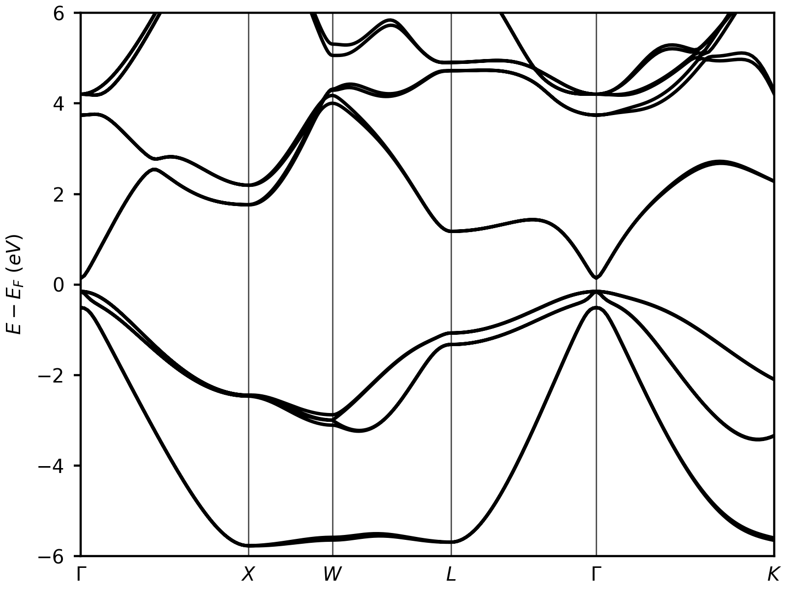
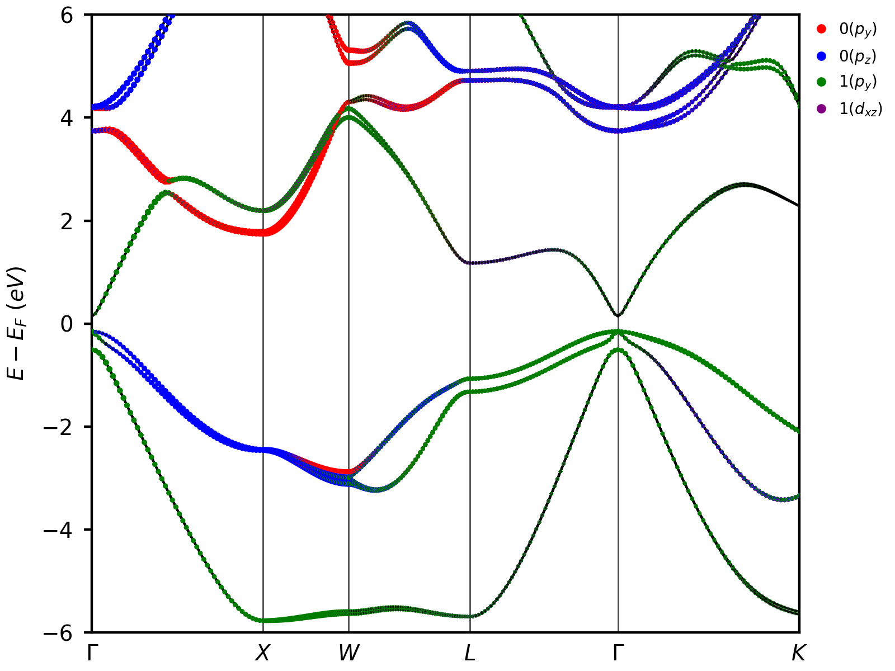
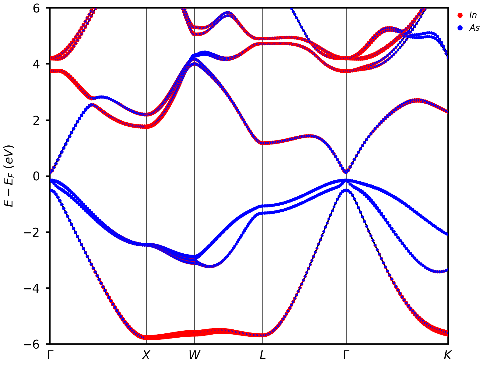
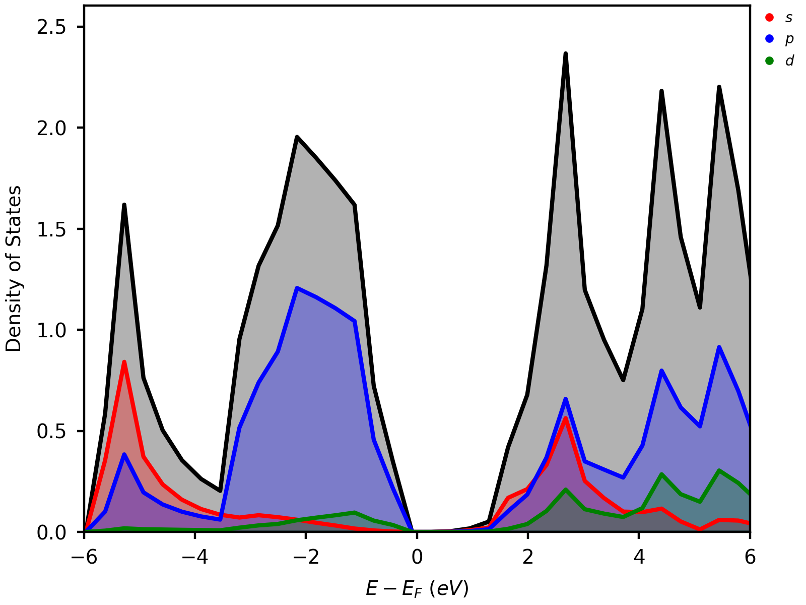
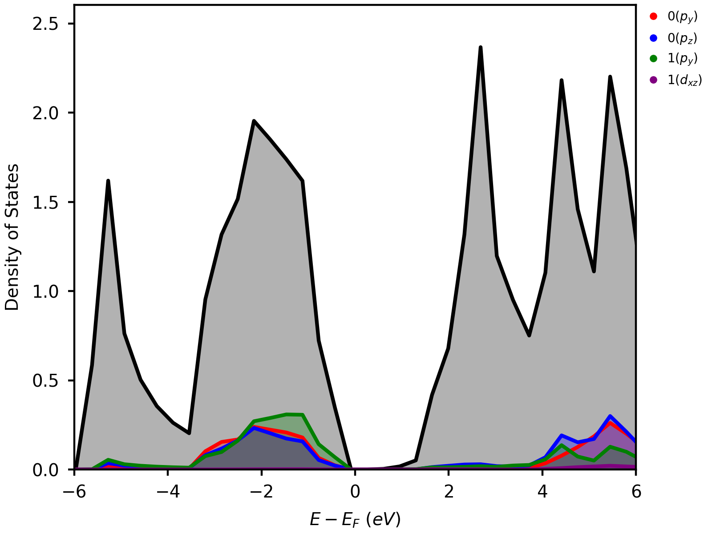
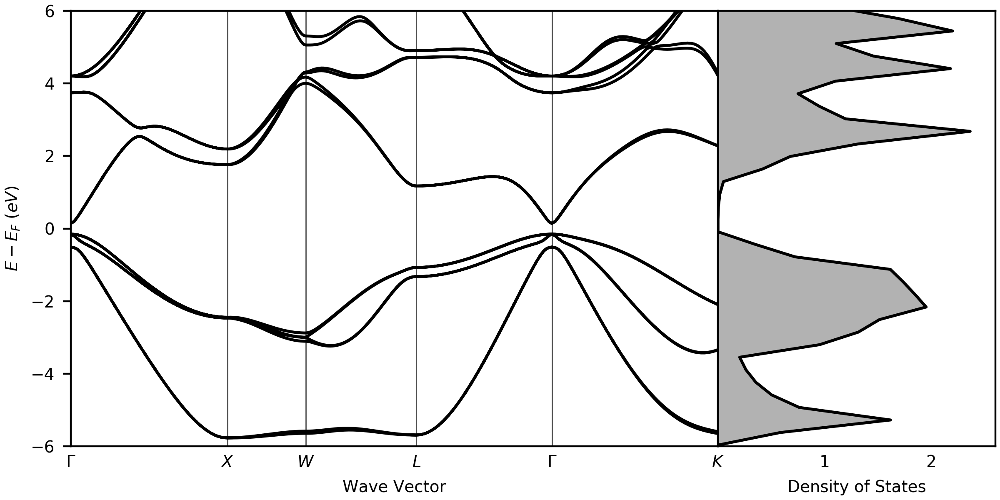
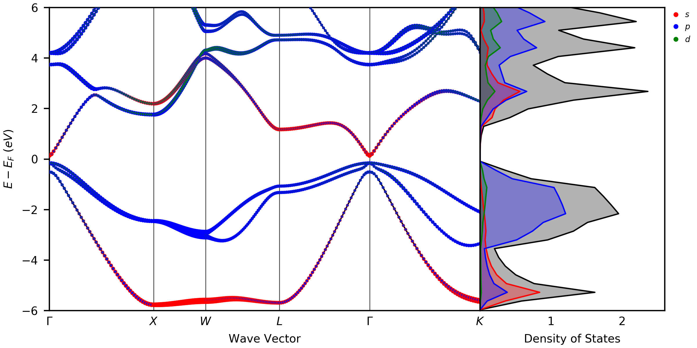
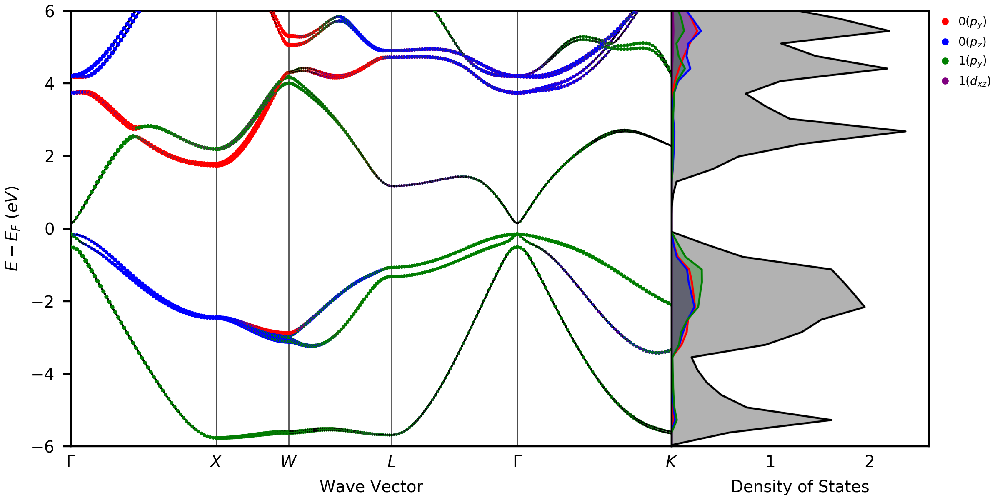
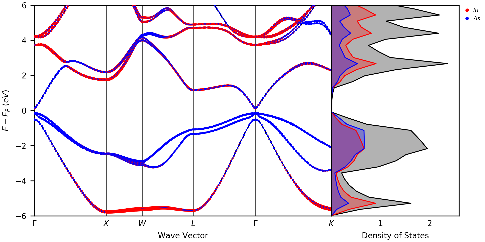
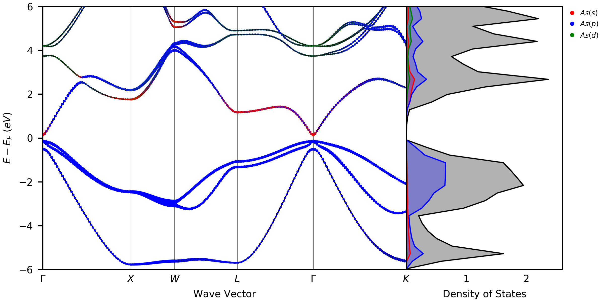

# vaspvis

A highly flexible and customizable library for visualizing electronic structure data from VASP calculations.

Find the full documentation [here](https://vaspvis.readthedocs.io/en/latest/modules.html) or by clicking the docs icon below.

[](https://vaspvis.readthedocs.io/en/latest/?badge=latest)

# Usage

This package was designed to give VASP users a flexible and easy to understand method
for generating a wide variaty of band structures and density of states plots. There are
four main modules in this package:

- `Band`
- `Dos`
- `standard`
- `utils`

The `Band` and `Dos` modules allow for the highest level of flexibility because the user
needs to pass in their own matplotlib axis, letting the user completely design the
external appearence of their plot. The `Band` and `Dos` modules will then parse the
VASP output data and append the it to the axis.

The `standard` module uses the `Band` and `Dos` modules internally and
was designed for those people who are not familiar with matplotlib
or don't need to completely customize their own figure. There are a total of 48 different
styles of plots to choose from in this module. It gives the user the capability to project
onto any orbital, any atom, or any element in their structure, as well as individual orbitals
on any atom or element. There are also options for spin polarized band structures and density
of states as well, letting the user make intricate plots with only a few lines of code.

The `utils` module is used to generate files for band unfolding calculations.

# Installation

```bash
pip install vaspvis
```

# Loading Data

```python
from vaspvis import Band, Dos

# Non-HSE Calculation (plain band structure)
bs = Band(folder='path to vasp output folder')


# Band Calculation (projected band structure)
bs_projected = Band(folder='path to vasp output folder', projected=True)


# Density of states (projected or non-projected)
dos = Dos(folder='path to vasp output folder')
```

**Important Note:** This package parses the EIGENVAL, PROCAR, KPOINTS, POSCAR, and INCAR files, be sure that
they are in the folder you load into vaspvis.

**Important Note:** For spin projected orbitals you must load the spin up and spin down chanels separately using the `spin = 'up'` or `spin = 'down'` options with loading data. Default is `spin = 'up'`.

# Band Unfolding

Band unfolding is useful for visualizing band structures of supercells and slab structures. The method used for calculating the band unfolded structure requires an integer transformation matrix from the bulk structure. To convert the slab structure so it has an integer matrix, the `convert_slab` function can be used to generate the new slab structure and also return the transformation matrix (M). More information about the band unfolding method can be found [here](https://wiki.fysik.dtu.dk/gpaw/tutorials/unfold/unfold.html)

```python
from vaspvis.utils import convert_slab

# This function returns and prints out the transformation matrix (M)
M = convert_slab(
    bulk_path='POSCAR_bulk', # POSCAR of the primitive bulk structure
    slab_path='POSCAR_slab', # POSCAR of the slab structure
    index=[1,1,1], # Miller index of the given slab structure
)
```

To generate the KPOINTS file for the band unfolded calculation the `generate_kpoints` function can be used

```python
from vaspvis.utils import generate_kpoints

high_symmetry_points = [
    [0.5,0.0,0.5], # X
    [0.0,0.0,0.0], # Gamma
    [0.5,0.0,0.5], # X
]

generate_kpoints(
    M=M, # M can be generated with the convert slab function
    high_symmetry_points=high_symmetry_points, # Special points
    n=50, # Number of segments between each special point
)
```

To plot the band structure the `Band` or `standard` module can be used. An example using the standard module is shown below.

```python
from vaspvis import standard as st

band_folder = 'PATH_TO_VASP_FOLDER'

# Transformation matrix generated from convert_slab
M = [
    [0,1,-1],
    [1,-1,0],
    [-8,-8,-8]
]

high_symm_points = [
    [0.5, 0.0, 0.5], # X
    [0.0, 0.0, 0.0], # Gamma
    [0.5, 0.0, 0.5]  # X
]

# All other functions in the standard library work with band unfolding too.
st.band_plain(
    folder=band_folder,
    erange=[-4,0],
    unfold=True,
    kpath='XGX',
    high_symm_points=high_symm_points,
    n=50,
    M=M,
)
```

# Examples

## Band Structures

### Plain Band Structure

```python
from vaspvis import standard

standard.band_plain(
    folder=band_folder
)
```



### s, p, d Projected Band Structure

```python
from vaspvis import standard

standard.band_spd(
    folder=band_folder
)
```


### Orbital Projected Band Structure

```python
from vaspvis import standard

standard.band_orbitals(
    folder=band_folder,
    orbitals=[0, 1, 2, 3, 4, 5, 6, 7, 8],
)
```


### Atom Projected Band Structure

```python
from vaspvis import standard

standard.band_atoms(
    folder=band_folder,
    atoms=[0, 1],
)
```


### Atom-Orbtial Projected Band Structure

```python
from vaspvis import standard

standard.band_atom_orbitals(
    folder=band_folder,
    atom_orbital_dict = {0:[1,3], 1:[1,7]}
)
```



### Atom s, p, d Projected Band Structure

```python
from vaspvis import standard

standard.band_atom_spd(
    folder=band_folder,
    atom_spd_dict={0:'spd'},
)
```


### Element Projected Band Structure

```python
from vaspvis import standard

standard.band_elements(
    folder=band_folder,
    elements=['In', 'As'],
)
```



### Element s, p, d Projected Band Structure

```python
from vaspvis import standard

standard.band_element_spd(
    folder=band_folder,
    element_spd_dict={'As':'spd'},
)
```


### Element Orbital Projected Band Structure

```python
from vaspvis import standard

standard.band_element_orbitals(
    folder=band_folder,
    element_orbital_dict={'As':[2], 'In':[3]},
)
```


## Density of Statess

### Plain Density of States

```python
from vaspvis import standard

standard.dos_plain(
    folder=dos_folder,
    energyaxis='x',
)
```


### s, p, d Projected Density of States

```python
from vaspvis import standard

standard.dos_spd(
    folder=dos_folder,
    energyaxis='x',
)
```



### Orbital Projected Density of States

```python
from vaspvis import standard

standard.dos_orbitals(
    folder=dos_folder,
    orbitals=[0, 1, 2, 3, 4, 5, 6, 7, 8],
    energyaxis='x',
)
```


### Atom Projected Density of States

```python
from vaspvis import standard

standard.dos_atoms(
    folder=dos_folder,
    atoms=[0, 1],
    energyaxis='x',
)
```


### Atom-Orbtial Projected Density of States

```python
from vaspvis import standard

standard.dos_atom_orbital(
    folder=dos_folder,
    atom_orbital_pairs=[[0,1], [0,3], [1, 1], [1,7]],
    energyaxis='x',
)
```



### Atom s, p, d Projected Density of States

```python
from vaspvis import standard

standard.dos_atom_orbital(
    folder=dos_folder,
    atom_orbital_pairs=[[0,1], [0,3], [1, 1], [1,7]],
    energyaxis='x',
)
```


### Element Projected Density of States

```python
from vaspvis import standard

standard.dos_elements(
    folder=dos_folder,
    elements=['In', 'As'],
    energyaxis='x',
)
```


### Element s, p, d Projected Density of States

```python
from vaspvis import standard

standard.dos_element_spd(
    folder=dos_folder,
    elements=['As'],
    energyaxis='x',
)
```


### Element Orbital Projected Density of States

```python
from vaspvis import standard

standard.dos_element_orbitals(
    folder=dos_folder,
    element_orbital_pairs=[['As', 2], ['In', 3]],
    energyaxis='x',
)
```


## Band Structure / Density of Statess

### Plain Band Structure / Density of States

```python
from vaspvis import standard

standard.band_dos_plain(
    band_folder=band_folder,
    dos_folder=dos_folder,
)
```



### s, p, d Projected Band Structure / Density of States

```python
from vaspvis import standard

standard.band_dos_spd(
    band_folder=band_folder,
    dos_folder=dos_folder,
)
```



### Orbital Projected Band Structure / Density of States

```python
from vaspvis import standard

standard.band_dos_orbitals(
    band_folder=band_folder,
    dos_folder=dos_folder,
    orbitals=[0, 1, 2, 3, 4, 5, 6, 7, 8],
)
```


### Atom-Orbtial Projected Band Structure / Density of States

```python
from vaspvis import standard

standard.band_dos_atom_orbital(
    band_folder=band_folder,
    dos_folder=dos_folder,
    atom_orbital_pairs=[[0,1], [0,3], [1, 1], [1,7]]
)
```



### Atom Projected Band Structure / Density of States

```python
from vaspvis import standard

standard.band_dos_atoms(
    band_folder=band_folder,
    dos_folder=dos_folder,
    atoms=[0, 1],
)
```


### Element Projected Band Structure / Density of States

```python
from vaspvis import standard

standard.band_dos_elements(
    band_folder=band_folder,
    dos_folder=dos_folder,
    elements=['In', 'As'],
)
```



### Element s, p, d Projected Band Structure / Density of States

```python
from vaspvis import standard

standard.band_dos_element_spd(
    band_folder=band_folder,
    dos_folder=dos_folder,
    elements=['As'],
)
```



### Element Orbital Projected Band Structure / Density of States

```python
from vaspvis import standard

standard.band_dos_element_orbitals(
    band_folder=band_folder,
    dos_folder=dos_folder,
    element_orbital_pairs=[['As', 2], ['In', 3]],
)
```


